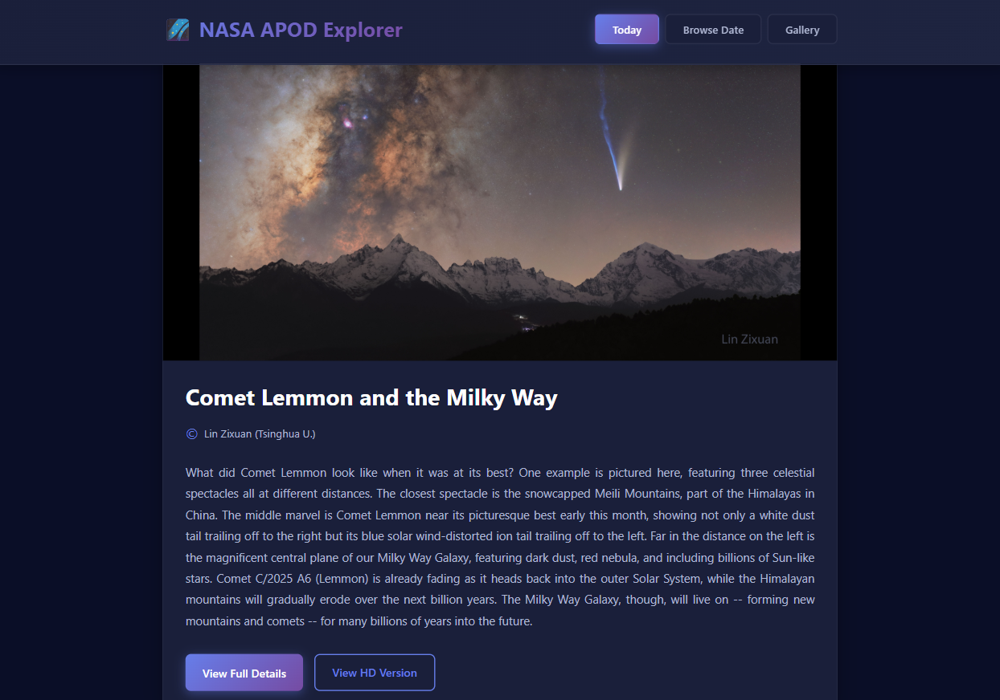
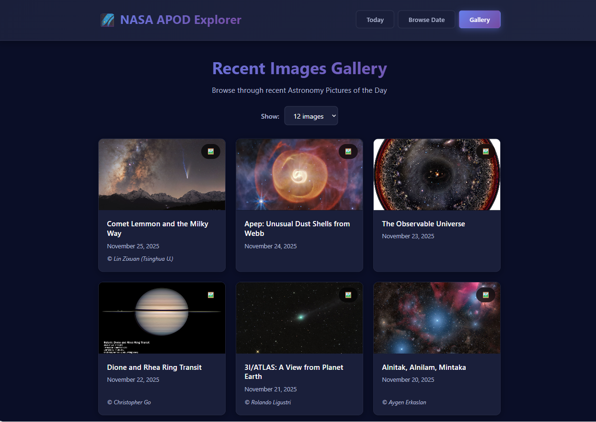
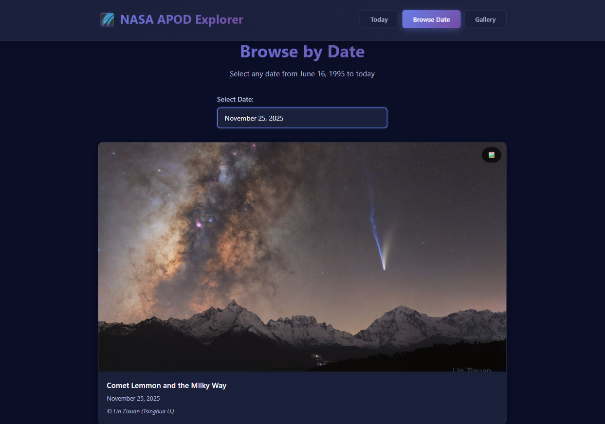

# NASA APOD Explorer

**FinFactor Technologies Coding Assessment / Task Submission**

*This project is developed as part of the FinFactor technologies coding assessment.*

*A full-stack web application for exploring NASA's Astronomy Picture of the Day (APOD). Built with Spring Boot backend and React + Vite frontend, featuring intelligent caching, beautiful UI, and responsive design.*
## Features

### Backend (Spring Boot)
- ✅ **RESTful API** with proper HTTP methods and status codes
- ✅ **Caffeine Caching** with configurable size limits and TTL expiry
- ✅ **Secure API Key Management** - NASA API key stored securely
- ✅ **Error Handling** - Comprehensive error handling with meaningful messages
- ✅ **CORS Configuration** - Properly configured for frontend access
- ✅ **Input Validation** - Date validation and parameter checking
- ✅ **Clean Architecture** - Separation of concerns (Controller, Service, Client layers)

### Frontend (React + Vite)
- ✅ **Today's APOD Dashboard** - Prominent display of today's picture
- ✅ **Date Picker** - Browse APODs from any date (June 16, 1995 to present)
- ✅ **Image Gallery** - Grid view of recent APODs with pagination
- ✅ **Detailed View** - Full-screen modal with complete explanation and metadata
- ✅ **Beautiful UI** - Modern, dark-themed interface with smooth animations
- ✅ **Fully Responsive** - Mobile, tablet, and desktop support
- ✅ **Loading States** - Skeleton loaders and loading indicators
- ✅ **Error Handling** - User-friendly error messages with retry options

## Setup Instructions

### 1. Clone or Download the Repository

```bash
cd nasa-api-task
```

### 2. NASA API Key Setup

Get your free NASA API key from [https://api.nasa.gov/](https://api.nasa.gov/)

**application.properties**
Edit `backend/src/main/resources/application.properties`:
```properties
nasa.api.key=your_api_key_here
```

> Note: The default `DEMO_KEY` works but has rate limits. Get your own key for better performance.

### 3. Backend Setup

```bash
# Navigate to backend directory
cd backend

# Run the Spring Boot application
mvn spring-boot:run
```

The backend server will start on **http://localhost:8080**

Verify it's running:
```bash
curl http://localhost:8080/api/apod/health
```

### 4. Frontend Setup

Open a new terminal window:

```bash
# Navigate to frontend directory
cd frontend

# Install dependencies
npm install

# Start the development server
npm run dev
```

The frontend will start on **http://localhost:5173**

## Screenshots

### Dashboard (Today's APOD)


### Recent Images Gallery


### Date Picker

